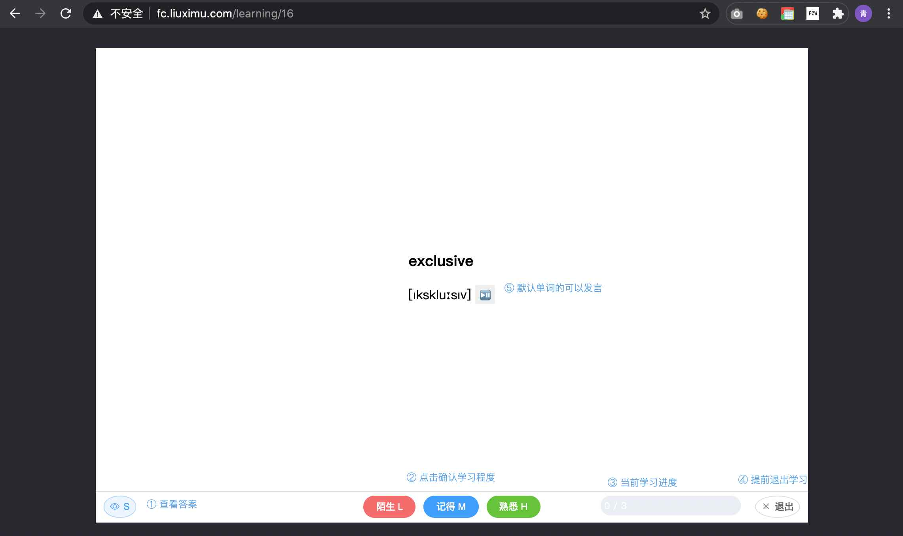

# 闪记卡

## 闪记卡的背后原理
在学习过程中，我们需要：
- 理解：将知识进行拆解再组合，和现有知识进行比对
- 记忆：新的知识需要反复记忆

在这个过程中需要：
- 建立知识体系，在闪记卡项目中，用 `我的知识体系` 作为根节点来表示自己的知识体系
- 记忆：每个知识卡片都会关联到一个记忆模板，定期提醒去复现

## 闪记卡网站使用

网站现在已经上线了，在 [http://fc.liuxmu.com](http://fc.liuximu.com)。免费开放注册使用。

#### 知识卡片的学习

最常用的功能是知识卡片的学习了

英语单词模板：

问答题模板：

#### 登录|注册

#### 知识体系结构
登录后会自动的进入知识体系结构页面

维护自己的知识体系结构只需要点击 ② 所示按钮

#### 知识卡片的添加/编辑
上图的 ② ③ 可以进入知识卡片的添加和编辑

#### 知识卡片模板的添加/编辑
知识卡片其实应用了知识卡片模板，上图的 ①。绝大多数情况下官方的模板是能够满足你的使用需求的，当然你可以自己添加。这个需要了解一点vue知识

#### 记忆曲线
当前只支持 艾宾浩斯记忆曲线，也没有开放添加的入口。

## 谷歌浏览器扩展
可以直接使用项目根目录下的 crx 文件。
英文单词会自动添加到 `智能单词本` 的知识树中。

##### omnibox的使用

#### 页面右键快速添加
对于英文单词，可以进行快速添加。

## 我要自己搭建！

无论是出于任何原因，你都可以自己搭建这个服务，很简单。
- 前端代码：在 fe 中，你可以自行编译，也可以直接使用 `dist` 文件夹的代码
- 服务端代码: 在 be 中， 进入 be
    - 你需要自己编译一下 `go build -o flashcard`
    - 初始化数据库，脚本在 `scripts/flashcard.sql`
    - 配置一下`conf` 文件夹的数据
    - 启动应用： `./flashcard >> log.log`

## 联系我

请提issue~